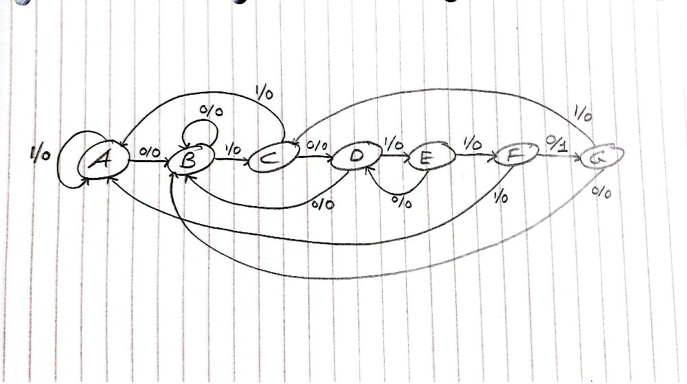

# 1. Explanation of Design
In this lab, using a finite state machine (FSM), a linear feedback shift register (LFSR) and a counter, a system was constructed which counts the number of times a certain codeword appears in the stream of bits generated by the LFSR. The codeword given was 010110 (hex 16). The LFSR constructed in the previous lab was modified to work in this design. The tap length was changed to 22 from 12, requiring changes to feedback generation (bitwise XOR on tap 21 and 20). 

A new FSM module was created to act as the sequence detector. The FSM works by moving through a number of states in order to reach a specific output. In this case, the FSM takes an input X corresponding to the least significant bit (LSB) of the stream of bits generated by the LFSR. The states represent the position of X in the codeword. The FSM only moves to the next state when the corresponding bit for that position is correct. This FSM outputs one when it has correctly reached the final state, otherwise it will return to the original state. Overlapping states can be handled by returning to a previous state that is not the idle state, for example an incorrect bit during state B causes a loop because 0 is still a valid bit. See the table and diagram below for the list of states and corresponding input output relation, as well as the state diagram showing all transitions for the FSM. 

| Current State | Input X | Next State | Output Y |
| ------------- | ------- | ---------- | -------- |
| A             | 0       | B          | 0        |
|               | 1       | A          | 0        |
| B             | 0       | B          | 0        |
|               | 1       | C          | 0        |
| C             | 0       | D          | 0        |
|               | 1       | A          | 0        |
| D             | 0       | B          | 0        |
|               | 1       | E          | 0        |
| E             | 0       | D          | 0        |
|               | 1       | F          | 0        |
| F             | 0       | G          | 1        |
|               | 1       | A          | 0        |
| G             | 0       | B          | 0        |
|               | 1       | C          | 0        |
*Table 1.1 List of states and corresponding input/outputs. State A represents the idle state and State F represents the final state*

*Figure 1.1: State diagram for FSM*

The states must be encoded by assigning them a binary value. For 8 states, 3 bit codes must be used. For optimal encoding, adjacent states were encoded only 1 bit apart when possible. See below for table containing the encoded states. There were no redundant states in this design so it could not be minimized. 

| Current State | Input X | Next State | Output Y |
| ------------- | ------- | ---------- | -------- |
| 000           | 0       | 001        | 0        |
|               | 1       | 000        | 0        |
| 001           | 0       | 001        | 0        |
|               | 1       | 010        | 0        |
| 010           | 0       | 011        | 0        |
|               | 1       | 000        | 0        |
| 011           | 0       | 001        | 0        |
|               | 1       | 100        | 0        |
| 100           | 0       | 011        | 0        |
|               | 1       | 101        | 0        |
| 101           | 0       | 110        | 1        |
|               | 1       | 000        | 0        |
| 110           | 0       | 001        | 0        |
|               | 1       | 010        | 0        |
*Table 1.2: List of encoded states and corresponding input/outputs. State 000 represents the idle state and State 101 represents the final state*

Finally the counter from the previous module was altered to increment each time the FSM output Y was high. The function diagram for the final design can be seen below. The modules all follow a rising edge sensitive design meaning the modules respond to changes in input only while the clock transitions from a low to high state. To FSM follows a more model, meaning the output depends only on state and not on input x. 

![[Pasted image 20260412151120.png]]
*Figure 1.2: Functional diagram*
# 2. Testing Plan
The LFSR and counter modules were tested using the previously designed testbenches. Two new testbenches were written, one for the FSM itself and one for the design as a whole. Firstly the FSM was tested using its own testbench to ensure correct sequence detection behaviour. See figure below for FSM behaviour. Reset is set high for 1 clock cycle, then the correct sequence is inputted, causing the output to go high as expected. 

![[Pasted image 20260412185412.png]]
*Figure 2.1: Waveform view of FSM testbench*

To test the top module, printing to the log was used as analysing the waveform itself proved difficult. Each time the count was incremented, the current LFSR codeword was printed to the console (see Fig. 2.2). It is easy to verify that each of these codewords contained the desired sequence. The simulation was ran for a total of 0.5ms. Because our tap length was 22, the total codewords is $2^{22} -1$, which is around 4 million (4,194,303).  A clock period of 2ns means that it would take approximately 8ms to run a full cycle of codewords. 

![[Pasted image 20260412200150.png]]
*Figure 2.2: Top module test bench log*
# 3. Demo
When targeting the to board, the 7-segment display is used to display the count, and the first switch (sw0) is used to enable reset. The clock is controlled through the clock divider module, and constrained in line 13 of the constraint file.
# 4. Results
For an entire cycle of the LFSR ($2^{22} - 1$ cycles) the total number of codewords found was 256. 

![[Pasted image 20260412213804.png]]*Figure 4.1: Waveform view of counter module*

![[Pasted image 20260412213857.png]]
*Figure 4.2: Waveform view of LFSR*

![[Pasted image 20260412214250.png]]
*Figure 4.3: Waveform view of top module*

![[Pasted image 20260412213935.png]]*Figure 4.4: Project Hierarchy*

![[Pasted image 20260412214420.png]]*Figure 4.5: Utilization report: register as flip flip*

![[Pasted image 20260412214521.png]]
*Figure 4.6: Utilization report*
